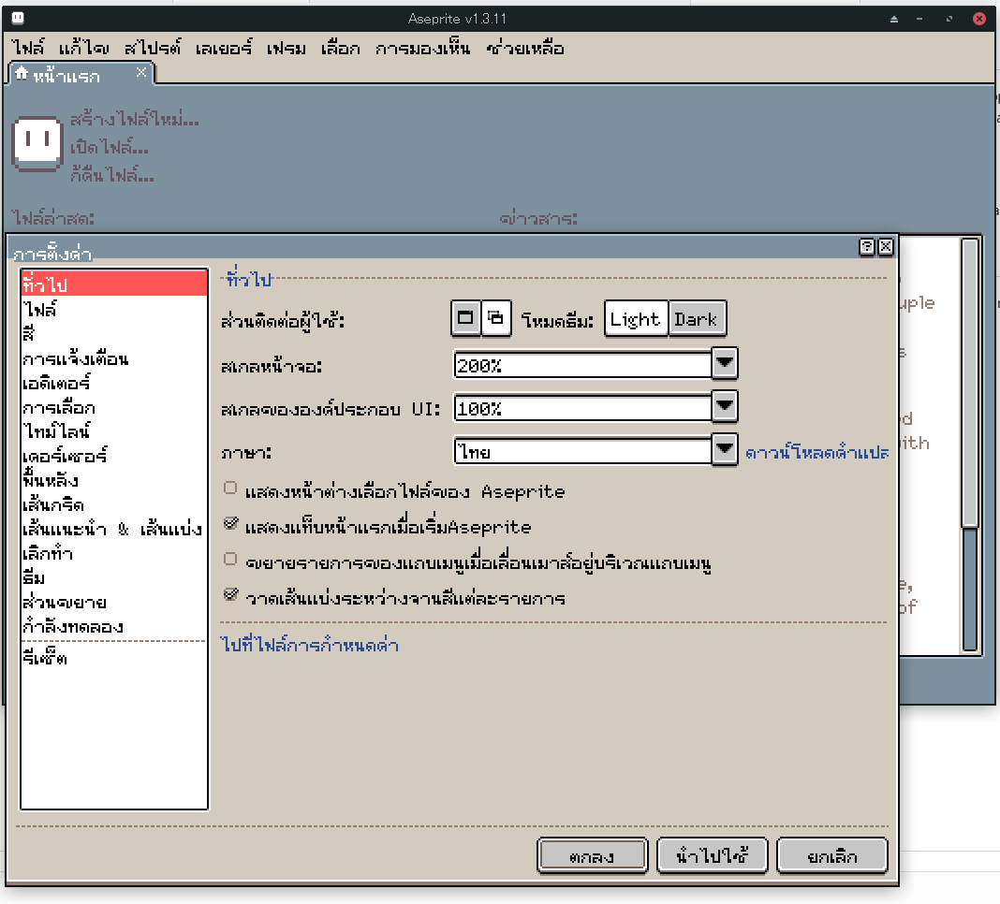
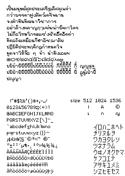

# aseprite-thai-font
Aseprite (ver < 1.3.12-beta) is expected to lack GPOS support(?), which means that the positions of vowels that use the mark are not displayed correctly, especially the M$ font (and it also scale font in weird ways), so we have worked around creating a new font that displays Thai characters correctly, which is now included in themes.

(The fonts are licensed as OFL; you can download and modify them.)

# to do
- [ ] Separate fonts into another repo(?) with its source code.
